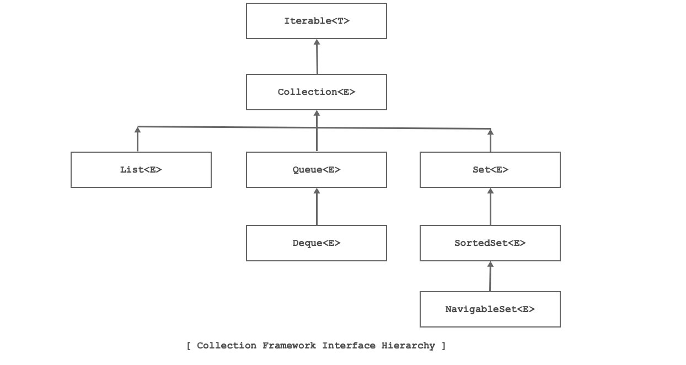

# OOPJ Notes Day-6 (04 March, 2026)

## Immutable Classes

- An immutable class is a class whose objects cannot be modified after they are created.
- To create an immutable class:
  1. Declare the class as `final` so it cannot be subclassed.
  2. Make all fields `private` and `final`.
  3. Provide a constructor to initialize all fields.
  4. Do not provide setter methods.
  5. If the class has mutable fields, return a copy of the field in the getter method.
- Example:

```java
final class ImmutableClass {
    private final String name;
    private final int age;

    public ImmutableClass(String name, int age) {
        this.name = name;
        this.age = age;
    }

    public String getName() {
        return name;
    }

    public int getAge() {
        return age;
    }
}

public class Program {
    public static void main(String[] args) {
        ImmutableClass obj1 = new ImmutableClass("Alice", 30);
        System.out.println(obj1.getName()); // Output: Alice
        System.out.println(obj1.getAge());  // Output: 30

        // obj1.name = "Bob"; // Error: cannot assign a value to final variable name
    }
}
```

---

## Enumerations

- An enumeration (enum) is a special data type that represents a group of constants.
- Enums are used to define a collection of constants that can be represented as a type.
- Example:

```java
enum Day {
    SUNDAY, MONDAY, TUESDAY, WEDNESDAY, THURSDAY, FRIDAY, SATURDAY
}

public class Program {
    public static void main(String[] args) {
        Day today = Day.MONDAY;
        System.out.println("Today is: " + today); // Output: Today is: MONDAY
    }
}
```

- Enums can have fields, methods, and constructors. They can also implement interfaces.

```java 
enum Day {
    SUNDAY("Weekend"), MONDAY("Weekday"), TUESDAY("Weekday"), WEDNESDAY("Weekday"), 
    THURSDAY("Weekday"), FRIDAY("Weekday"), SATURDAY("Weekend");

    private String type;

    Day(String type) {
        this.type = type;
    }

    public String getType() {
        return type;
    }
}

public class Program {
    public static void main(String[] args) {
        Day today = Day.MONDAY;
        System.out.println("Today is: " + today); // Output: Today is: MONDAY
        System.out.println("It's a: " + today.getType()); // Output: It's a: Weekday
    }
}
```

---

## Auto boxing

- Auto boxing is the automatic conversion of primitive types to their corresponding wrapper classes.

- Example:

```java
public class Program {
    public static void main(String[] args) {
        int num = 10;
        Integer obj = num; // Auto boxing
        System.out.println(obj); // Output: 10
    }
}
```

## Java API

- Java API (Application Programming Interface) is a collection of pre-written classes and interfaces that provide functionality for various tasks.
- It is organized into packages, such as `java.util`, `java.lang`, and `java.math`.

### java.util

- Contains utility classes such as `ArrayList`, `HashMap`, `Scanner`, etc.
- This package provides data structures, algorithms, and utility methods for working with collections, dates, and more.
- Important classes in `java.util` include:
  - `ArrayList`: A resizable array implementation of the List interface.
  - `HashMap`: A hash table-based implementation of the Map interface.
  - `Scanner`: A class for reading input from various sources, including the console.
  - `Date`: A class for representing date and time.

### java.lang

- Contains fundamental classes that are automatically imported into every Java program.
- Important classes in `java.lang` include:
  - `String`: A class for representing and manipulating strings.
  - `Math`: A class that provides methods for performing basic numeric operations such as exponentiation, logarithms, and trigonometric functions.
  - `System`: A class that provides access to system resources and allows you to perform input and output operations.
  - `Object`: The root class of the Java class hierarchy. Every class in Java inherits from `Object`.
  
### java.math

- Contains classes for performing arbitrary-precision integer and decimal arithmetic.
- Important classes in `java.math` include:
  - `BigInteger`: A class for performing arbitrary-precision integer arithmetic.
  - `BigDecimal`: A class for performing arbitrary-precision decimal arithmetic.
  - `MathContext`: A class that provides context for numerical operations, such as precision and rounding mode.
- These classes are useful for applications that require high precision, such as financial calculations or scientific computations.

## Generics and Collections - Overview

### Generics

- Generics allow you to create classes, interfaces, and methods that operate on a specified type.
- They provide type safety at compile time and eliminate the need for type casting.

#### Generic Methods

- A generic method is a method that can operate on any type specified by the caller.
- Syntax:

```java
public <T> void methodName(T param) {
    // method body
}
```

- Example:

```java
public class Program {
    public static <T> void printArray(T[] array) {
        for (T element : array) {
            System.out.print(element + " ");
        }
        System.out.println();
    }

    public static void main(String[] args) {
        Integer[] intArray = {1, 2, 3, 4, 5};
        String[] strArray = {"Hello", "World"};

        printArray(intArray); // Output: 1 2 3 4 5 
        printArray(strArray); // Output: Hello World 
    }
}
```

#### Generic Classes

- A generic class is a class that can operate on any type specified by the user.
- Syntax:

```java
public class ClassName<T> {
    // class body
}
```

- Example:

```java
public class Box<T> {
    private T content;

    public void setContent(T content) {
        this.content = content;
    }

    public T getContent() {
        return content;
    }
}
public class Program {
    public static void main(String[] args) {
        Box<Integer> intBox = new Box<>();
        intBox.setContent(123);
        System.out.println(intBox.getContent()); // Output: 123

        Box<String> strBox = new Box<>();
        strBox.setContent("Hello");
        System.out.println(strBox.getContent()); // Output: Hello
    }
}
```

#### Uses of Generics

- Generics are used to create reusable code that can work with different types.
- They provide type safety at compile time, reducing the risk of runtime errors.
- Generics eliminate the need for type casting, making code cleaner and easier to read.
- They are widely used in Java Collections Framework to create type-safe collections.

#### Restrictions on Generics

- You cannot create instances of type parameters (e.g., `new T()` is not allowed).
- You cannot declare static fields or methods that use type parameters.
- You cannot use primitive types as type parameters (e.g., `Box<int>` is not allowed, but `Box<Integer>` is valid).
- Type parameters cannot be used in exception handling (e.g., `catch (T e)` is not allowed).
- Type parameters cannot be used in static contexts (e.g., `static T value;` is not allowed).

## Collections in Java 

### Collection

- Any instance which contains multiple elements is called as collection.
- In java, data structure is also called as collection.

### Collection Framework

- Collection framework is a library of data structure classes on the top of it we can develop Java application.
- In Java, collection framework talk about use not about implementation.
- In Java, when we use collection to store instance then it doesnt contain instance rather it contains reference of the instance.
- To use collection framework, we should import java.util package.



### Iterable

- It is interface declared in java.lang package.
- It is introduced in jDK 1.5.
- Implementing this interface allows an object to be the target of the "for-each loop" statement.
- Methods:
  - Iterator iterator()
  - default Spliterator spliterator()
  - default void forEach(Consumer<? super T> action)