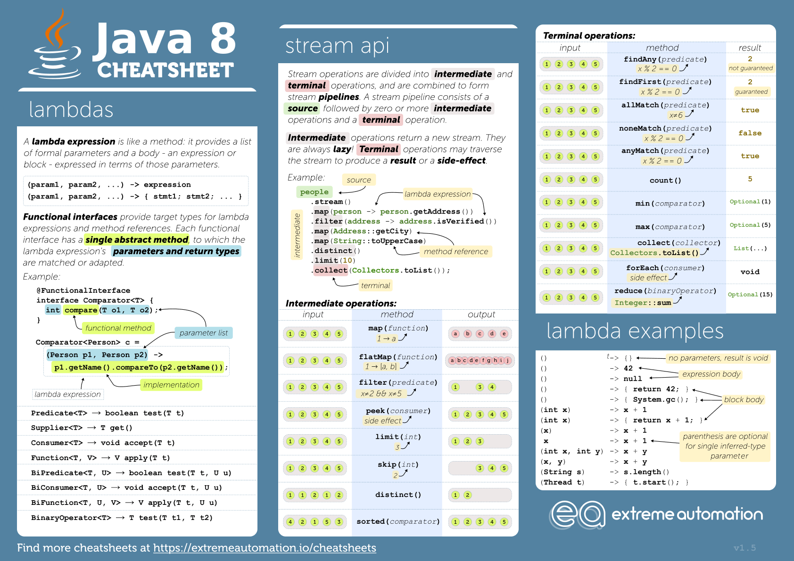

# OOPJ Notes Day-7 (05 March 2026)

## Introduction to Streams

- A Stream in Java is a sequence of elements supporting functional-style operations like filtering, mapping, and reducing.
- It is different from a collection as it does not store data but processes it on demand.
- Key Characteristics of Streams
  - Declarative: Uses a functional approach rather than imperative loops.
  - Pipelining: Operations are chained together to form a pipeline.
  - Internal Iteration: Stream API handles iteration, improving efficiency.
  - Lazy Execution: Operations execute only when a terminal operation is invoked.
  - Parallel Processing: Supports parallel execution for performance benefits.
- Streams vs. Collections
  - Collection
    - Storage: Stores elements.
    - Iteration: External iteration (e.g., for loop)
    - Modification: Can be modified (add, remove)
    - Consumption: Can be iterated multiple times
    - Parallelism: Requires manual handling
  - Stream
    - Storage: Does not store elements
    - Iteration: Internal iteration
    - Modification: Immutable (cannot modify elements)
    - Comsumption: Can be consumed only once
    - Parallelism: Supports parallel processing easily

### Stream Operations

- Intermediate Operations: These operations return a new stream and are lazy. Examples include filter, map, sorted, and distinct.
- Terminal Operations: These operations produce a result or side-effect and trigger the execution of the stream. Examples include forEach, collect, reduce, and count.

### Map vs FlatMap

#### Map

- The map operation transforms each element of the stream into another form, resulting in a stream of the same size. It applies a function to each element and returns a new stream with the transformed elements.
- Example: If you have a stream of strings and you want to convert them to their lengths, you can use map to achieve this.
- Example Code:

```java
import java.util.Arrays;
import java.util.List;
import java.util.stream.Collectors;
public class MapExample {
    public static void main(String[] args) {
        List<String> words = Arrays.asList("Hello", "World", "Java", "Streams");
        
        // Using map to convert each word to its length
        List<Integer> lengths = words.stream()
                                     .map(String::length)
                                     .collect(Collectors.toList());
        
        System.out.println(lengths); // Output: [5, 5, 4, 7]
    }
}
```

#### FlatMap

- The flatMap operation is used to flatten a stream of collections into a single stream. It takes a function that returns a stream for each element and then flattens the resulting streams into one stream.
- Example: If you have a stream of lists of strings and you want to flatten it into
a single stream of strings, you can use flatMap to achieve this.
- Example Code:

```java
import java.util.Arrays;
import java.util.List;
import java.util.stream.Collectors;
public class FlatMapExample {
    public static void main(String[] args) {
        List<List<String>> listOfLists = Arrays.asList(
            Arrays.asList("Hello", "World"),
            Arrays.asList("Java", "Streams")
        );
        
        // Using flatMap to flatten the stream of lists into a single stream of strings
        List<String> flatList = listOfLists.stream()
                                           .flatMap(List::stream)
                                           .collect(Collectors.toList());
        
        System.out.println(flatList); // Output: [Hello, World, Java, Streams]
    }
}
```

---

#### Reduce

- The reduce operation is a terminal operation that combines the elements of a stream into a single result using a specified binary operator. It takes an identity value and a binary operator as arguments and applies the operator cumulatively to the elements of the stream.
- Example: If you have a stream of integers and you want to calculate their sum, you can use reduce to achieve this.
- Example Code:

```java
import java.util.Arrays;
import java.util.List;
public class ReduceExample {
    public static void main(String[] args) {
        List<Integer> numbers = Arrays.asList(1, 2, 3, 4, 5);
        
        // Using reduce to calculate the sum of the numbers
        int sum = numbers.stream()
                         .reduce(0, (a, b) -> a + b);
        
        System.out.println(sum); // Output: 15
    }
}
```

---

#### Sorted

- The sorted operation is an intermediate operation that returns a stream consisting of the elements of the original stream sorted according to natural order or a specified comparator.
- Example: If you have a stream of strings and you want to sort them alphabetically, you can use sorted to achieve this.
- Example Code:

```java
import java.util.Arrays;
import java.util.List;
public class SortedExample {
    public static void main(String[] args) {
        List<String> words = Arrays.asList("Banana", "Apple", "Cherry", "Date");
        
        // Using sorted to sort the words alphabetically
        List<String> sortedWords = words.stream()
                                        .sorted()
                                        .collect(Collectors.toList());
        
        System.out.println(sortedWords); // Output: [Apple, Banana, Cherry, Date]
    }
}
```

---

#### Distinct

- The distinct operation is an intermediate operation that returns a stream consisting of the distinct elements of the original stream. It uses the equals() method to determine equality and removes duplicates from the stream.
- Example: If you have a stream of integers with duplicates and you want to get a stream of unique integers, you can use distinct to achieve this.
- Example Code:

```java
import java.util.Arrays;
import java.util.List;
import java.util.stream.Collectors;
public class DistinctExample {
    public static void main(String[] args) {
        List<Integer> numbers = Arrays.asList(1, 2, 2, 3, 4, 4, 5);
        
        // Using distinct to get unique numbers
        List<Integer> uniqueNumbers = numbers.stream()
                                            .distinct()
                                            .collect(Collectors.toList());
        
        System.out.println(uniqueNumbers); // Output: [1, 2, 3, 4, 5]
    }
}
```

---

#### AnyMatch

- The anyMatch operation is a terminal operation that returns true if any elements of the stream match the provided predicate. It short-circuits and returns as soon as a match is found.
- Example: If you have a stream of integers and you want to check if any of them are greater than 5, you can use anyMatch to achieve this.
- Example Code:

```java
import java.util.Arrays;
import java.util.List;
public class AnyMatchExample {
    public static void main(String[] args) {
        List<Integer> numbers = Arrays.asList(1, 2, 3, 4, 5);
        
        // Using anyMatch to check if any number is greater than 5
        boolean anyGreaterThan5 = numbers.stream()
                                        .anyMatch(n -> n > 5);
        
        System.out.println(anyGreaterThan5); // Output: false
    }
}
```

---

#### Filter

- The filter operation is an intermediate operation that returns a stream consisting of the elements of the original stream that match the given predicate. It is used to select elements based on a condition.
- Example: If you have a stream of integers and you want to filter out the even numbers, you can use filter to achieve this.
- Example Code:

```java
import java.util.Arrays;
import java.util.List;
import java.util.stream.Collectors;
public class FilterExample {
    public static void main(String[] args) {
        List<Integer> numbers = Arrays.asList(1, 2, 3, 4, 5);
        
        // Using filter to get only even numbers
        List<Integer> evenNumbers = numbers.stream()
                                            .filter(n -> n % 2 == 0)
                                            .collect(Collectors.toList());
        
        System.out.println(evenNumbers); // Output: [2, 4]
    }
}
```

---

#### Count

- The count operation is a terminal operation that returns the count of elements in the stream. It is used to determine the number of elements that match a certain condition or to count the total number of elements in the stream.
- Example: If you have a stream of integers and you want to count how many of them
are greater than 3, you can use count to achieve this.
- Example Code:

```java
import java.util.Arrays;
import java.util.List;
public class CountExample {
    public static void main(String[] args) {
        List<Integer> numbers = Arrays.asList(1, 2, 3, 4, 5);
        
        // Using count to count how many numbers are greater than 3
        long countGreaterThan3 = numbers.stream()
                                        .filter(n -> n > 3)
                                        .count();
        
        System.out.println(countGreaterThan3); // Output: 2
    }
}
```

---

#### Limit

- The limit operation is an intermediate operation that returns a stream consisting of the first n elements of the original stream. It is used to restrict the number of elements in the stream.
- Example: If you have a stream of integers and you want to get only the first
3 elements, you can use limit to achieve this.
- Example Code:

```java
import java.util.Arrays;
import java.util.List;
import java.util.stream.Collectors;
public class LimitExample {
    public static void main(String[] args) {
        List<Integer> numbers = Arrays.asList(1, 2, 3, 4, 5);
        
        // Using limit to get only the first 3 elements
        List<Integer> limitedNumbers = numbers.stream()
                                             .limit(3)
                                             .collect(Collectors.toList());
        
        System.out.println(limitedNumbers); // Output: [1, 2, 3]
    }
}
```

---

- java.util.stream.Stream API


### Types of Primitive Streams

### IntStream

- It is a specialized stream for handling primitive int values, providing methods for efficient processing of int data without the overhead of boxing and unboxing.
- It offers various operations such as filtering, mapping, and reducing, similar to the Stream API but optimized for primitive int values.
- It also provides methods for generating ranges of int values, creating infinite streams, and performing aggregate operations like sum and average.
- For AI Applications, IntStream can be used for processing large datasets of integer values efficiently, such as in machine learning algorithms or data analysis tasks where performance is critical.
- Ref : <https://www.oracle.com/webfolder/technetwork/tutorials/moocjdk8/documents/week1/lesson-1-1.pdf>

- Example-1 : Using IntStream to generate a range of integers and perform operations on them.

```java
import java.util.IntSummaryStatistics;
import java.util.stream.IntStream;
public class IntStreamExample {
    public static void main(String[] args) {
        // Generate a range of integers from 1 to 10
        IntStream intStream = IntStream.rangeClosed(1, 10);
        
        // Filter even numbers and print them
        System.out.println("Even numbers from 1 to 10:");
        intStream.filter(n -> n % 2 == 0).forEach(System.out::println);
        
        // Use of Map method to square the numbers and print them
        IntStream squaredStream = IntStream.rangeClosed(1, 10).map(n -> n * n);
        System.out.println("Squared numbers from 1 to 10:");
        squaredStream.forEach(System.out::println);

        // Use of Reduce method to calculate the sum of numbers from 1 to 10
        int sum = IntStream.rangeClosed(1, 10).reduce(0, (a, b) -> a + b);
        System.out.println("Sum of numbers from 1 to 10: " + sum);

        // Use of anyMatch to check if there are any numbers greater than 5
        boolean anyGreaterThan5 = IntStream.rangeClosed(1, 10).anyMatch(n -> n > 5);
        System.out.println("Are there any numbers greater than 5? " + anyGreaterThan5);

        // Use of count to count the number of even numbers from 1 to 10
        long countEven = IntStream.rangeClosed(1, 10).filter(n -> n % 2 == 0).count();
        System.out.println("Count of even numbers from 1 to 10: " + countEven);

        // Generate another stream for summary statistics
        IntStream anotherIntStream = IntStream.rangeClosed(1, 10);
        
        // Get summary statistics of the range
        IntSummaryStatistics stats = anotherIntStream.summaryStatistics();
        System.out.println("Summary Statistics:");
        System.out.println("Count: " + stats.getCount());
        System.out.println("Sum: " + stats.getSum());
        System.out.println("Min: " + stats.getMin());
        System.out.println("Average: " + stats.getAverage());
        System.out.println("Max: " + stats.getMax());
    }
}
```

---

### LongStream

- It is a specialized stream for handling primitive long values, providing methods for efficient processing of long data without the overhead of boxing and unboxing.
- It offers various operations such as filtering, mapping, and reducing, similar to the Stream API but optimized for primitive long values.
- It also provides methods for generating ranges of long values, creating infinite streams, and performing aggregate operations like sum and average.
- For AI Applications, LongStream can be used for processing large datasets of long values efficiently, such as in machine learning algorithms or data analysis tasks where performance is critical.
- Ref : <https://javadevcentral.com/java-8-longstream/>

- Example-1 : Using LongStream to generate a range of long integers and perform operations on them.

```java
import java.util.LongSummaryStatistics;
import java.util.stream.LongStream;
public class LongStreamExample {
    public static void main(String[] args) {
        // Generate a range of long integers from 1 to 10
        LongStream longStream = LongStream.rangeClosed(1, 10);
        
        // Filter even numbers and print them
        System.out.println("Even numbers from 1 to 10:");
        longStream.filter(n -> n % 2 == 0).forEach(System.out::println);
        
        // Use of Map method to square the numbers and print them
        LongStream squaredStream = LongStream.rangeClosed(1, 10).map(n -> n * n);
        System.out.println("Squared numbers from 1 to 10:");
        squaredStream.forEach(System.out::println);

        // Use of Reduce method to calculate the sum of numbers from 1 to 10
        long sum = LongStream.rangeClosed(1, 10).reduce(0, (a, b) -> a + b);
        System.out.println("Sum of numbers from 1 to 10: " + sum);

        // Use of anyMatch to check if there are any numbers greater than 5
        boolean anyGreaterThan5 = LongStream.rangeClosed(1, 10).anyMatch(n -> n > 5);
        System.out.println("Are there any numbers greater than 5? " + anyGreaterThan5);

        // Use of count to count the number of even numbers from 1 to 10
        long countEven = LongStream.rangeClosed(1, 10).filter(n -> n % 2 == 0).count();
        System.out.println("Count of even numbers from 1 to 10: " + countEven);

        // Generate another stream for summary statistics
        LongStream anotherLongStream = LongStream.rangeClosed(1, 10);
        
        // Map method to cube the numbers and print them
        LongStream cubedStream = anotherLongStream.map(n -> n * n * n);
        System.out.println("Cubed numbers from 1 to 10:");
        cubedStream.forEach(System.out::println);

        // Reduce method to calculate the product of numbers from 1 to 10
        long product = LongStream.rangeClosed(1, 10).reduce(1, (a, b) -> a * b);
        System.out.println("Product of numbers from 1 to 10: " + product);


        // Get summary statistics of the range
        LongSummaryStatistics stats = anotherLongStream.summaryStatistics();
        System.out.println("Summary Statistics:");
        System.out.println("Count: " + stats.getCount());
        System.out.println("Sum: " + stats.getSum());
        System.out.println("Min: " + stats.getMin());
        System.out.println("Average: " + stats.getAverage());
        System.out.println("Max: " + stats.getMax());
    }
}
```

### DoubleStream

- It is a specialized stream for handling primitive double values, providing methods for efficient processing of double data without the overhead of boxing and unboxing.
- It offers various operations such as filtering, mapping, and reducing, similar to the Stream API but optimized for primitive double values.
- It also provides methods for generating ranges of double values, creating infinite streams, and performing aggregate operations like sum and average.
- For AI Applications, DoubleStream can be used for processing large datasets of double values efficiently, such as in machine learning algorithms or data analysis tasks where performance is critical.

- Ref: <https://medium.com/@AlexanderObregon/javas-doublestream-parallel-method-explained-8884ecaf25b1>

## Overview of Java Date Time API

- The Java Date Time API, introduced in Java 8, provides a comprehensive set of classes for handling date and time in a more efficient and user-friendly way compared to the older java.util.Date and java.util.Calendar classes.
- Key Features of Java Date Time API
  - Immutable Classes: The classes in the Date Time API are immutable, meaning that once an instance is created, it cannot be modified. This makes them thread-safe and easier to work with.
  - Clear API Design: The API is designed with a clear and consistent structure, making it easier to understand and use.
  - Support for Time Zones: The API provides robust support for time zones, allowing developers to work with dates and times across different regions.
  - Better Date and Time Manipulation: The API includes methods for adding or subtracting time units, formatting and parsing dates, and handling date arithmetic more easily.
  - Integration with Legacy APIs: The Date Time API can be easily integrated with the older java.util.Date and java.util.Calendar classes, allowing for smooth transitions in existing codebases.
  - For AI Applications, the Java Date Time API can be used for handling time-sensitive data, scheduling tasks, and managing time zones in applications that require accurate date and time processing.

- Example-1 : Using LocalDate to represent a date without time and perform operations on it.

```java
import java.time.LocalDate;
public class LocalDateExample {
    public static void main(String[] args) {
        // Create a LocalDate instance representing the current date
        LocalDate currentDate = LocalDate.now();
        System.out.println("Current Date: " + currentDate);
        
        // Create a LocalDate instance representing a specific date
        LocalDate specificDate = LocalDate.of(2022, 1, 1);
        System.out.println("Specific Date: " + specificDate);
        
        // Add days to the current date
        LocalDate futureDate = currentDate.plusDays(10);
        System.out.println("Future Date (10 days later): " + futureDate);
        
        // Subtract months from the current date
        LocalDate pastDate = currentDate.minusMonths(2);
        System.out.println("Past Date (2 months earlier): " + pastDate);
        
        // Get the day of the week for the specific date
        String dayOfWeek = specificDate.getDayOfWeek().toString();
        System.out.println("Day of the week for " + specificDate + ": " + dayOfWeek);
    }
}
```

- Example-2 : Using LocalDateTime to represent a date and time and perform operations on it.

```java
import java.time.LocalDateTime;
public class LocalDateTimeExample {
    public static void main(String[] args) {
        // Create a LocalDateTime instance representing the current date and time
        LocalDateTime currentDateTime = LocalDateTime.now();
        System.out.println("Current Date and Time: " + currentDateTime);
        
        // Create a LocalDateTime instance representing a specific date and time
        LocalDateTime specificDateTime = LocalDateTime.of(2022, 1, 1, 12, 0);
        System.out.println("Specific Date and Time: " + specificDateTime);
        
        // Add hours to the current date and time
        LocalDateTime futureDateTime = currentDateTime.plusHours(5);
        System.out.println("Future Date and Time (5 hours later): " + futureDateTime);
        
        // Subtract minutes from the current date and time
        LocalDateTime pastDateTime = currentDateTime.minusMinutes(30);
        System.out.println("Past Date and Time (30 minutes earlier): " + pastDateTime);
    }
}
```

- Example-3 : Using ZonedDateTime to represent a date and time with time zone information.

```java
import java.time.ZonedDateTime;
import java.time.ZoneId;
public class ZonedDateTimeExample {
    public static void main(String[] args) {
        // Create a ZonedDateTime instance representing the current date and time in the system default time zone
        ZonedDateTime currentZonedDateTime = ZonedDateTime.now();
        System.out.println("Current Zoned Date and Time: " + currentZonedDateTime);
        
        // Create a ZonedDateTime instance representing a specific date and time in a specific time zone
        ZonedDateTime specificZonedDateTime = ZonedDateTime.of(2022, 1, 1, 12, 0, 0, 0, ZoneId.of("America/New_York"));
        System.out.println("Specific Zoned Date and Time: " + specificZonedDateTime);
        
        // Convert the specific ZonedDateTime to another time zone
        ZonedDateTime convertedZonedDateTime = specificZonedDateTime.withZoneSameInstant(ZoneId.of("Europe/London"));
        System.out.println("Converted Zoned Date and Time (London): " + convertedZonedDateTime);
    }
}
```

---

## Reflection in Java

- What is Metadata?
  - Data about data is called as metadata. In other words, metadata refers to data that provides    information about other data.
  - For example, metadata for a photo might include:
        1. The date and time it was taken
        2. The location where it was taken
        3. The camera used to take it
        4. The resolution of the image.
    - In the case of digital media, metadata can include information about:
        1. the artist
        2. title
        3. genre and album of a particular song or video.
    - In a file management application, metadata such as:
        1. file name
        2. size
        3. creation date and modification date are commonly used to organize and search for files.
- Metadata of Interface
    1. What is the name of interface?
    2. In which package it is declared?
    3. Which is the access modifier of interface?
    4. Which annotations are used on interface?
    5. Which are the super interfaces of interface?
    6. Which are the members declared inside interface?
- Metadata of Class
    1. What is the name of class?
    2. In which package it is declared?
    3. Which are the modifiers used on class?
    4. Which are the annotations used on class?
    5. Which is the super class of class?
    6. Which are the super interfaces of the class?
    7. Which are the members declared inside class?
- Metadata of the Field
    1. What is the name of the field?
    2. Which is the type of field?
    3. Which are the modifiers of field?
    4. Which annotations has been used on the field?
    5. Whether field is declared or inherited field?
- Metadata of the method
    1. What is the name of method?
    2. Which are the modifiers used with method?
    3. Which is the return type of method?
    4. Which are the parameters of the methods?
    5. Which exceptions method throws?
    6. Which annotations has been used on the method.
    7. Whether method is declared or inerhited method?
- Applications of Metadata
    1. Metadata removes the need for native C/C++ header and library files when compiling.
    2. Integrated Development Environment(IDE) uses metadata to help us write code. Its IntelliSense feature parses metadata to tell us what fields and methods a type offers and in the case of a method, what arameters the method expects.
    3. Metadata allows an objectʼs fields to be serialized into a memory block, sent to another machine, and    then deserialized, re-creating the objectʼs state on the remote machine.
    4. The Garbage Collector uses metadata to keep track of each object's lifecycle, from creation to    destruction.
- Reflection
    1. Reflection in Java is a feature that allows a program to examine or modify the behavior of a class,    method, or object at runtime.
    2. It is a relatively advanced feature and should be used only by developers who have a strong grasp of    the fundamentals of the language.
    3. Reflection is a powerful technique and can enable applications to perform operations which would    otherwise be impossible.
        - using reflection, we can:
            - Obtain information about the class at runtime, such as its name, superclass, implemented         interfaces, constructors, methods, and fields.
            - Create new objects of a class dynamically, without knowing the class name at compile time.
            - Access and modify the values of fields in an object, even if they are declared as private.
            - Invoke methods on an object dynamically, without knowing the method names at compile time.
- How to use reflection in Java? Consider the following code:

```java
class Person
{
    //Instance Field
    int a;
    //Instance Method
    public void Show()
    {
        System.out.println(a);
    }
}
class PersonTest
{
    public static void main(String[] args) {
        Person p=new Person(); //Creating instance of class Person
    }
}
```

- When class loader loads Person, PersonTest class for execution then it create instance of java.lang.Class per loaded type on Method area. Instance contains metadata of the loaded type.
- java.lang.Class class
  - Class class is a final class declared in java.lang package.
  - The entry point for all reflection operations is java.lang.Class.
  - Instances of the class java.lang.Class represent classes and interfaces in a running Java application.
  - Class has no public constructor. Instead Class objects are constructed automatically by the Java    Virtual Machine.
  - Methods of java.lang.Class:
    - public static Class<?> forName(String className) throws ClassNotFoundException
    - public Annotation[] getAnnotations()
    - public Annotation[] getDeclaredAnnotations()
    - public ClassLoader getClassLoader()
    - public Constructor<?>[] getConstructors() throws SecurityException
    - public Constructor getConstructor(Class<?>... parameterTypes) throws NoSuchMethodException, SecurityException
    - public Field getDeclaredField(String name) throws NoSuchFieldException, SecurityException
    - public Field[] getDeclaredFields() throws SecurityException
    - public Field getField(String name) throws NoSuchFieldException, SecurityException
    - public Field[] getFields() throws SecurityException
    - public Class<?>[] getInterfaces()
    - public Method[] getMethods() throws SecurityException
    - public Method[] getDeclaredMethods()throws SecurityException
    - public String getName()
    - public String getSimpleName()
    - public Package getPackage()
    - public InputStream getResourceAsStream(String name)
    - public String getTypeName()
    - public T newInstance() throws InstantiationException, IllegalAccessException
- Retrieving Class Objects by using getClass() method of java.lang.Object class

```java
public class ReflectionDemo 
{
    public static void main(String[] args) {

    Integer in=new Integer(10);

    Class<?> c=in.getClass();

    System.out.println(c.getName());  //Print the class name variable
    }
}
```

```java

class Demo
{
int a;
}

public class ReflectionDemo {
    
public static void main(String[] args) {

Demo d=new Demo();
d.a=20;
Class<?> c2=d.getClass(); //Here we are assigning class of variable d to ref of class Class<>

//Now we will use methods of class Class<> to get the Metadata of class Demo

System.out.println(c2.getName());  //Print Class Name

// Print Package Name, Similarly there are other methods to get the metadata of the class
System.out.println(c2.getPackageName());

}
}
```

- Using Class.forName() method
  - If the fully-qualified name of a class is available, it is possible to get the corresponding Class using the static method Class.forName().

```java
class Demo
{
 int a;
}
public class ReflectionDemo {
    
 public static void main(String[] args) {
  Demo d=new Demo();
  d.a=20;
        //Class.forName() method may throw ClassNotFoundException so we have to surrend below statement in try-catch block
  Class<?> c2=Class.forName("com.cdac.reflection.ReflectionDemo");

        //Now we will use methods of class Class<> to get the Metadata of class Demo

  System.out.println(c2.getName());     //Print Class Name

        // Print Package Name, Similarly there are other methods to get the metadata of the class
  System.out.println(c2.getPackageName());  
 }

}
```

- Examine Type Metadata

```java
import java.lang.reflect.Modifier;
public class Program {
    public static void main(String[] args) {

        Class<?> c = Integer.class;

        String typeName = c.getName(); //Returns the name of the entity represented by this Class object.

        String simpleTypeName = c.getSimpleName(); //Returns the simple name of the underlying class.

        Package pkg = c.getPackage();
        String packageName = pkg.getName(); //Return the name of this package.

        int mod= c.getModifiers();
        String modifiers = Modifier.toString(mod); //Returns string representation of the set of modifiers.

        Class<?> sc = c.getSuperclass();
        String superCassName = sc.getName();//Returns the name of the super class

        Class<?>[] si = c.getInterfaces();
        StringBuffer sb = new StringBuffer();
        for (Class<?> i : si) {
        sb.append(i.getName());//Returns the name of the super interfaces
        }
    }
}
```

- Examine Field Metadata

```java
import java.lang.reflect.Field;
import java.lang.reflect.Modifier;
public class Program {
    public static void main(String[] args) {
        Class<?> c = Integer.class;
        Field[] fields = c.getFields(); //Returns an array of public fields that are declared in the class or its superclasses

        Field[] declaredFields = c.getDeclaredFields(); //Returns an array of all the fields declared in the class

        for (Field field : declaredFields) {
        String modifiers = Modifier.toString(field.getModifiers());
        String typeName = field.getType().getSimpleName();
        String fieldName = field.getName();
        System.out.println( modifiers+" "+typeName+" "+fieldName);
        }
    }
}
```

- getFields() returns an array of public fields that are declared in the class or its superclasses. This includes fields inherited from the superclass or any interface that the class implements. This method does not return any private or protected fields, regardless of whether they are inherited or declared in the class.
- getDeclaredFields() returns an array of all the fields declared in the class. This includes public, private, and protected fields. It does not include any fields inherited from a superclass or an interface.
- Examine Method Metadata

```java
import java.lang.reflect.Method;
import java.lang.reflect.Modifier;
import java.lang.reflect.Parameter;
public class Program {
    public static void main(String[] args) {
        Class<?> c = Integer.class;

        Method[] methods = c.getMethods();
        Method[] declaredMethods = c.getDeclaredMethods();

        for (Method method : declaredMethods) {
        String modifiers = Modifier.toString( method.getModifiers());
        String returnType = method.getReturnType().getSimpleName();
        String methodName = method.getName();
        StringBuffer paramList = new StringBuffer("( ");
        Parameter[] parameters = method.getParameters();

        for( Parameter parameter : parameters ) {
        String type = parameter.getType().getSimpleName();
        paramList.append(type);
        paramList.append(" ");
        String name = parameter.getName();
        paramList.append(name);
        paramList.append(", ");
        }

        if( parameters.length > 0 )
        paramList.deleteCharAt( paramList.length() - 2 );
        paramList.append(" )");
        StringBuffer exceptionList = new StringBuffer( );
        Class<?>[] exceptionTypes= method.getExceptionTypes();

        if( exceptionTypes.length > 0 )
        exceptionList.append("throws ");

        for( Class<?> exceptionType : exceptionTypes) {
        exceptionList.append( exceptionType.getSimpleName() );
        exceptionList.append( ", ");
        }

        if( exceptionTypes.length > 0 )
        exceptionList.deleteCharAt( exceptionList.length() - 2 );
        System.out.println( modifiers+" "+ returnType+" "+methodName+""+paramList+""+exceptionList);
        }
    }
}
```

- getMethods(): This method returns an array of Method objects that represent all the public methods of the class (including inherited methods) and the public methods declared in any interfaces implemented by the class.
- getDeclaredMethods(): This method returns an array of Method objects that represent all the methods declared explicitly by the class, including both public and non-public methods. It does not include any inherited methods or the methods declared in any interfaces implemented by the class.
- Accessing private fields using Reflection

```java
import java.lang.reflect.Field;
class Complex{
    private int real;
    private int imag;
    public Complex() {
    this.real = 10;
    this.imag = 20;
    }
    public int getReal() {
    return this.real;
    }
    public int getImag() {
    return this.imag;
    }
}
public class Program {
    public static void main(String[] args) {
        try 
        {
            Complex complex = new Complex();
            System.out.println("Real Number : "+complex.getReal());
            System.out.println("Imag Number : "+complex.getImag());

            Class<?> c = complex.getClass();
            Field field = null;
            field = c.getDeclaredField("real");
            field.setAccessible(true);
            field.setInt(complex, 50);
            field = c.getDeclaredField("imag");
            field.setAccessible(true);
            field.setInt(complex, 60);
            System.out.println("Real Number : "+complex.getReal());
            System.out.println("Imag Number : "+complex.getImag());
        } 
        catch (NoSuchFieldException | SecurityException | IllegalArgumentException | IllegalAccessException e) 
        {
            e.printStackTrace();
        }
    }
}
```

- Reflection to access and invoke a private constructor of a class.

```java
import java.lang.reflect.Constructor;
import java.lang.reflect.InvocationTargetException;
class Complex {
    private int real;
    private int imag;
    private Complex(int real, int imag) {
        this.real = real;
        this.imag = imag;
    }
    public int getReal() {
        return this.real;
    }
    public int getImag() {
        return this.imag;
    }
}
public class Program {
    public static void main(String[] args) {
        try 
        {
            Class<?> c = Complex.class;
            Constructor<?> constructor = c.getDeclaredConstructor(int.class, int.class);
            constructor.setAccessible(true);
            Complex complex = (Complex) constructor.newInstance(50, 60);
            System.out.println("Real Number : " + complex.getReal());
            System.out.println("Imag Number : " + complex.getImag());
        } 
        catch (NoSuchMethodException | SecurityException | InstantiationException | IllegalAccessException
        | IllegalArgumentException | InvocationTargetException e)
        {
            e.printStackTrace();
        }
    }
}
```