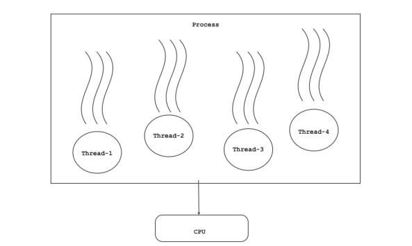
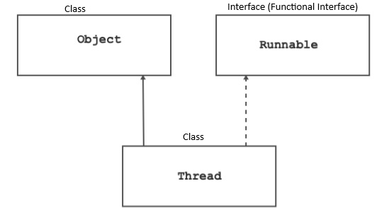
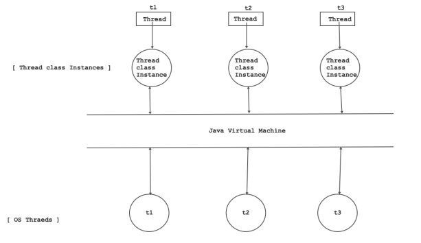
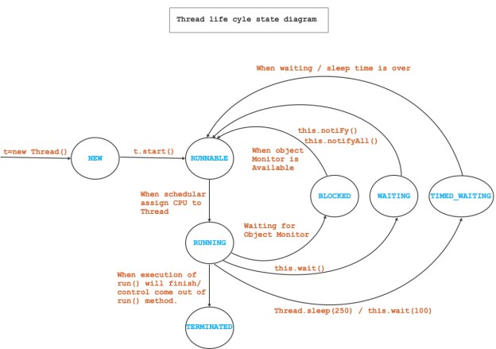

# OOPJ Notes Day-8 (06 March 2026)

## Multithreading

### Singletasking versus multitasking

- Process Definition:
  - Program in execution is called as process.
  - Running instance of a program is called as process.
  - Process is also called as task.
- Term Singletasking and multitasking is always used in the context of Operating System
- An ability of operating system to execute single task at a time is called as Singletasking.
  - Example: MS DOS is singletasking operating system.
- An ability of operating system to execute multiple task at a time is called as Multitasking.
  - Example: MS Windows, Linuxm Mac OS etc.

### Thread concept

- Thread Definition
  - Lightweight process is called as thread.
  - According to Java, thread is a seperate path of execution which runs independently
- Therad always resides in process.
- If we want to utilize H/W resources( memory, cpu) efficiently then we should use thread.
- If any application take help of single thread for the execution then such application is called as single threaded application.
- If any application take help of multiple threads for the execution then such application is called as multi threaded application.
- Thread is Non Java resource. It is also called unmanged resource.

### process based versus thread based multitasking



- Before transfering control of CPU from one process to another, schedular must save state of the process into process control block. Then another process get access of CPU. It is called context switching.
- Since context switching is a heavy task, proess based multitasking is called as heavy weight multitasking.
- Threads always reside into process. Hence to access the resources thread do not require context switching. So thread based multitasking is called as lightweight multitasking.

### Java is multithreaded

- When we start execution of Java application, JVM starts execution of main thread and Garbage collector. Due to these threads, every Java application is multithreaded.
- Main Thread
  - It is called as user thread / Non dameon thread.
  - Main thread is responsible for invoking main method.
  - In Java, priority of main thread is 5( Thread.NORM_PRIORITY ).
- Garbage Collector
  - It is called as daemon thread / background thread.
  - Garbage collector is responsible for invoking finalize method and deallocating / releasing memory of unused objects.
  - Garbage collector is also called as finalizer.
  - In Java, priority of garbage collector is 8( Thread.NORM_PRIORITY + 3).

### Multithreading in Java

- If we want to use threads in Java then we should use Types declared in java.lang package.
  - Interface
    - Runnable
  - Classes
    - Thread
    - ThreadGroup
    - ThreadLocal
  - Enum:
    - Thread.State
  - Exception
    - IllegalThreadStateException
    - IllegalMonitorStateException
    - InterruptedException

#### Runnable

- It is functional interface declared in java.lang package.
- Method:
  - "void run( )" is a method of java.lang.Runnable interface. In the context of multi-threading, run() method is called as business logic method.
  - If we want to create thread in Java then we should use Runnable interface.
- Example:

```java
class Task implements Runnable{
    @Override
    public void run() {
    System.out.println("Hello from run method()");
    }
}
public class Program {
    public static void main(String[] args) {
        Runnable target = new Task();       //Upcasting
        Thread th = new Thread(target);     //Creating the Thread and assigning implementation of of Run() method
        th.start();                         //Starting the thread
    }
}
```

#### Thread Class



- Thread is sub class of java.lang.Object class and it implements java.lang.Runnable interface.
- Instance of Thread class is not a OS thread. Rather it represents OS thread.
- JVM is responsible for mapping Thread instance with OS thread.

- Nested Type
  - Thread.State is enum declared inside Thread class.
- Example:

```java
 import java.lang.Thread.State;
 public class Program {
    public static void main(String[] args) {
    State[] states = State.values();
        for (State state : states) {
        System.out.print(state.name()+"  "+state.ordinal());
        }
    }
 }
 ```

- Output of above java program:

 ```java
 NEW 0
 RUNNABLE 1
 BLOCKED 2
 WAITING 3
 TIMED_WAITING 4
 TERMINATED 5
 ```

- Fields inside Thread Class:
  - public static final int MIN_PRIORITY //1
  - public static final int NORM_PRIORITY //5
  - public static final int MAX_PRIORITY //10

- Constructors inside Thread Class:

- public Thread()

```java
Thread t1=new Thread();
```

- public Thread(String name)

```java
Thread t1=new Thread("My Thread-1");    //Creating thread with name
```

- public Thread(Runnable target)

```java
Thread t1=new Thread(instance of Runnable interface);   //Creating thread by passing instance of a class who has implemented Runnable interface
```

- public Thread(Runnable target, String name)

```java
Thread t1=new Thread(instance of Runnable interface, "My Thread-1");
```

- public Thread(ThreadGroup group, Runnable target, String name)

```java
 ThreadGroup group = new ThreadGroup("Group DBDA");
 Runnable target = new Task();
 Thread th = new Thread( group, target );
```

- Methods inside Thread Class:
  - public static Thread currentThread()
  - public final String getName()
  - public final void setName(String name)
  - public final int getPriority()
  - public final void setPriority(int newPriority)
  - public Thread.State getState()
  - public final boolean isAlive()
  - public final boolean isDaemon()
  - public final void join() throws InterruptedException
  - public final void setDaemon(boolean on)
  - public static void sleep(long millis) throws InterruptedException
  - public void start()
  - public static void yield()

- Getting information of main thread

```java
public static void main(String[] args) {
    Thread thread = Thread.currentThread();
    System.out.println( thread.toString() ); //Thread[main,5,main]
    //main : thread's name
    //5 : priority
    //main : thread group.
}
```

```java
public static void main(String[] args) {
    Thread thread = Thread.currentThread();
    String name = thread.getName();
    System.out.println("Thread Name : "+name);
    int priority= thread.getPriority();
    System.out.println("Thread Priority : "+priority);
    ThreadGroup group = thread.getThreadGroup();
    System.out.println("Thread Group : "+group.getName());
    State state = thread.getState();
    System.out.println("Thread State : "+state.name());
    boolean type = thread.isDaemon();
    System.out.println("Thread Type : "+( type ? "Daemon Thread"    : "User Thread") );
    boolean status = thread.isAlive();
    S.ystem.out.println("Thread Status : "+( status ? "Alive" :    "Dead") );
}
```

Output is:

```java
 Thread Name : main
 Thread Priority : 5
 Thread Group : main
 Thread State : RUNNABLE
 Thread Type : User Thread
 Thread Status : Alive
```

- Getting information of garbage collector:

```java
 class Sample{
    public Sample( ) {
    System.out.println("Inside constructor of    "+this.getClass().getSimpleName());
    }
    public void print( ) {
    System.out.println("Inside print method of    "+this.getClass().getSimpleName());
    }
    @Override
    protected void finalize() throws Throwable {
        System.out.println("Inside finalize method of    "+this.getClass().getSimpleName());
        Thread thread = Thread.currentThread();
        String name = thread.getName();
        System.out.println("Thread Name : "+name);
        int priority= thread.getPriority();
        System.out.println("Thread Priority : "+priority);
        ThreadGroup group = thread.getThreadGroup();
        System.out.println("Thread Group : "+group.getName());
        State state = thread.getState();
        System.out.println("Thread State : "+state.name());
        boolean type = thread.isDaemon();
        System.out.println("Thread Type : "+( type ? "Daemon
        Thread" : "User Thread") );
        boolean status = thread.isAlive();
        System.out.println("Thread Status : "+( status ? "Alive" :
        "Dead") );
    }
    public static void main(String[] args) {
    Sample sample = null;
    sample = new Sample();
    sample.print();
    sample = null;
    //System.gc(); //To Call inidicate JVM to run Garbage Collector
    Runtime.getRuntime().gc();
    }
 }
 ```

- Output is:

```java
Thread Name : Finalizer
Thread Priority : 8
Thread Group : system
Thread State : RUNNABLE
Thread Type : Daemon Thread
Thread Status : Alive
```

#### Thread life cycle

- Thread.State is nested enum declared in java.lang.Thread class.

```java
 public enum State {
 NEW, RUNNABLE, BLOCKED, WAITING, TIMED_WAITING, TERMINATED;
 }
```

- The life cycle of a thread in Java consists of several states, which are as follows:

  - A thread can be in only one state at a given point in time.
  - These states are virtual machine states which do not reflect any operating system thread states.
    - New: The thread is in the new state when it is created but has not yet started executing. The thread remains in this state until the start() method is called.
    - Runnable: The thread is in the runnable state when it is ready to run, but the thread scheduler has not selected it to run yet. When the thread scheduler selects the thread, it moves to the running state.
    - Running: The thread is in the running state when its run() method is being executed.
    - Blocked: The thread is in the blocked state when it is waiting for a monitor lock to be released, so it can enter a synchronized block or method.
    - Waiting: The thread is in the waiting state when it is waiting for some other thread to perform a particular action before it can continue executing.
    - Timed Waiting: The thread is in the timed waiting state when it is waiting for a specific amount of time for some other thread to perform a particular action before it can continue executing.
    - Terminated: The thread is in the terminated state when its run() method has completed execution.

#### What do you know about final/finally/finalize?

- final
  - It is keyword, we can use with local variable, field, method and class.
  - If we use final modifier with method local variable and field then it is considered as constant.
    - If we use final modifier with method then we can not override/redefine method inside sub class
    - If we use final modiifer with class then we can not extend it.
- finally
  - It is a block that we can use with try/catch.
  - If we want to close local resources then we should use finally block.

```java
    public static void main(String[] args) {
        Scanner sc = null; //Method local variable
        try{
        sc = new Scanner( System.in );
        //TODO
        }catch( Exeption ex ){
        ex.printStackTrace();
        }finally{
        sc.close(); //Releasing local resource
        }
    }
```

- finalize
  - It is non final method of java.lang.Object class.
  - If we want to release class level( which is declared as field ) resources then we should use finalize method.

```java
class Sample{
    private Scanner sc; //Field
    public Sample( ) {
    this.sc = new Scanner( System.in);
    }
    //TODO
    @Override
    protected void finalize() throws Throwable {
    this.sc.close();
    }
}
public class Program {
    public static void main(String[] args) {
    Sample sample = null;
    sample = new Sample();
    sample.print();
    sample = null;
    System.gc
    }
}
```

#### Thread Creation in Java

- In Java, we can create thread using 2 ways:
  - By implementing Runnable interface
  - By extending Thread class.
- Thread Creation in by implementing Runnable interface
  - If we create Thread instance but do not call start() method on it then is considered in NEW state.

```java
Runnable target = new Task(); //Upcasting
Thread th = new Thread(target); //NEW
```

- To start execution of thread we should start() method.
- If we call start() method on thread instance then thread is considered in RUNNABLE state.

```java
Runnable target = new Task(); //Upcasting
Thread th = new Thread(target); //NEW
th.start(); //RUNNABLE
```

- If we call start() method on already started thread then start() method throws IllegalThreadStateException

```java
Runnable target = new Task(); //Upcasting
Thread th = new Thread(target); //NEW
th.start(); //RUNNABLE
th.start(); //IllegalThreadStateException
```

- When control come out of run method then thread gets terminated. In this case thread is considered in TERMINATED state.
- In following cases, control can come out of run method and thead can terminate:
  - Successful completion of run method.
  - Getting exception during execition of run method.
  - Execution of jump statement( return statement ) inside run method.
  - If we want to suspend execution of running thread then we should use sleep() method. It is a static method of java.lang.Thread class.

```java
public static void sleep(long millis) throws InterruptedException
```

- millis->the length of time to sleep in milliseconds
- 1000 millisecond = 1 second
- Syntax: ThreadName.sleep(time in miliseconds)

```java
Thread.sleep( 250 )
```

- Following methods calls are considered as blocking calls:
  - sleep()
  - suspend()
  - join()
  - wait()
- Input operations in run method
- Generally we should use blocking calls very carefully.
- If we want to group functionally realated threads together then we should use ThreadGroup.

```java
 public static void main(String[] args) {
    Runnable target = new Task();
    ThreadGroup threadGroup = new ThreadGroup("DBDA");
    Thread th1 = new Thread(threadGroup, target);
    th1.setName("User Thread#1");
    th1.start();
    Thread th2 = new Thread(threadGroup, target);
    th2.setName("User Thread#2");
    th2.start();
 }
 ```

- Thread creation using Runnable:

```java
class Task implements Runnable{
    private Thread thread;
    public Task( String name ) {
    this.thread = new Thread(this, name);
    this.thread.start();
    }
    @Override
    public void run() {
    //TODO: Business Logic
    }
}
public class Program {
    public static void main(String[] args) {
    Task th1 = new Task("User Thread#1");
    Task th2 = new Task("User Thread#2");
    }
}
```

- what is the relation between start and run method?
  - start() method do not call run() method.
  - If we call start() method on java thread instance then it is considered as request to the JVM to get thread from operating system and to map it with java thread instance.
  - Schedular is responsible for picking thread from queue and assiging CPU to it. When schedular assign CPU to the OS thread then JVM invoke run method on instance who has implemented java.lang.Runnable interface.
- Thread Creation in by extending Thread class

```java
 class Task extends Thread{
    public Task( String name ) {
    super(name);
    this.start();
    }
    @Override
    public void run() {
    //TODO : Business logic
    }
    }
    public class Program {
    public static void main(String[] args) {
    Task th1 = new Task("User Thread#1");
    }
 }
 ```

#### What is the difference between creating thread usingRunnable and Thread class

- Runnable: Consider Thread creation using Runnable interface:

```java
class A implements Runnable{
 private Thread thread;
 public A( ){
 this.thread = new Thread( this);
 this.thread.start();
 }
 @Override
 public void run( ){
 //TODO: Write business logic here
 }
}
```

- Here class can still extend another class.
- Let us try to create sub class of class A

```java
class B extends A{
    public B( ){
    }
    @Override
    public void run( ){
    //TODO: Write business logic here
    }
}
class C extends B{
    public C( ){
    }
    @Override
    public void run( ){
    //TODO: Write business logic here
    }
}
class D extends C{
    public D( ){
    }
    @Override
    public void run( ){
    //TODO: Write business logic here
    }
}
```

- If create instance of class B then first A class and then B class constructor will call. In class A, Thread registration process will start and when OS thread will get CPU then B class run method will call. Same is the case of class C and D. In simple words, If class implement Runnable interface then that class and all its sub classes must participate in Threading behavior.

- Thread: Consider Thread creation by extending Thread class:

```java
class A extends Thread{
    public A( ){
    this.start();
    }
    @Override
    public void run( ){
    //TODO: Write business logic here
    }
}
```

- In Java, class can extend more than one class. So here we can not extend another class / if class already sub class of another class then we can not extend Thread.
- Let us try to create sub class of class A

```java
class B extends A{
    public B( ){
    }
    @Override
    public void run( ){
    //TODO: Write business logic here
    }
}
class C extends B{
    public C( ){
    }
    @Override
    public void run( ){
    //TODO: Write business logic here
    }
}
class D extends C{
    public D( ){
    }
    @Override
    public synchronized void start() {
    //Keep Empty
    }
}
```

- In above code class A, B and C must participate into Threading behavior. But by overriding start( ) method class D can come out of threading behavior.

#### Types of Thread in java

- User Thread
  - It is also called as non daemon thread.
  - If we create any thread from main method / another user thread then it is by default considered as user thread.
  - Default Properties of main thead:
    - Type: User Thread
    - Priority: 5
    - Thread group: main
- Daemon Thread
  - It is also called as background thread.
  - If we create any thread from finalze method / another deamon thread then it is by default considered as daemon thread.
  - Default Properties of GC thead:
    - Type: Daemon Thread
    - Priority: 8
    - Thread group: system
  - Using "public final boolean isDaemon()" method we can check type of thread.
  - Using "public final void setDaemon(boolean on)" method we can marks thread as either a daemon thread or a user thread.

```java
Thread th = new Thread( target, name );
th.setDaemon( true ); //Not thread will be considered as Daemon
thread.
th.start();
```

##### What is the difference between User Thread and Daemon Thread

- User threads have higher priority than daemon threads, which means that the JVM will keep them running as long as the application is running. Daemon threads, on the other hand, have lower priority, and the JVM will stop them as soon as all user threads have terminated.

##### interrupt() / interrupted() / isInterrupted()

- An interrupt() is a notification sent to a thread to request that it should stop what it's doing and do something else.

```java
 public void interrupt()
 ```

 ```java
class Task implements Runnable {
    @Override
    public void run() {
        for (int count = 1; count <= 100; ++count) {
        System.out.println("Count : " + count);
        if( count == 50 )
        Thread.currentThread().interrupt();
        }
    }
}
```

- When the interrupt signal is sent to the thread, it will set an interrupted flag on the thread. We can check that flag using isInterrupted() method.

```java
public boolean isInterrupted();
    for (int count = 1; count <= 100; ++count) {
    if( !Thread.currentThread().isInterrupted()) {
    System.out.println("Count : " + count);
    if( count == 50 ) {
    Thread.currentThread().interrupt();
    }
    }
}
```

- isInterrupted() method only check interrupted status but do not reset the status.
- Using interrupted() method we can check interrupted status but it reset interrupted status. In other words, if this method were to be called twice in succession, the second call would return false

```java
public static boolean interrupted()
```

```java
class Task implements Runnable {
    @Override
    public void run() {
        for (int count = 1; count <= 100; ++count) {
            if (!Thread.currentThread().isInterrupted()) {
            System.out.println("Count : " + count);
            if (count == 50) {
            Thread.currentThread().interrupt();
            }
            }
        }
        while (!Thread.interrupted()) {
            for (int count = 100; count <= 120; ++count)
            System.out.println("Count : " + count);
        }
    }
    }
    public class Program {
        public static void main(String[] args) throws Exception {
        Thread thread = new Thread(new Task());
        thread.start();
        }
 }
```

##### Thread Priority

- OS schedular is responsible for assigning CPU to the thread.
- On the basis of thread priority schedular assign CPU to the thread.
- Thread priorities of Java and OS are different.
- Thread priorities in Java:
  - Thread.MIN_PRIORITY = 1;
  - Thread.NORM_PRIORITY = 5;
  - Thread.MAX_PRIORITY = 10;
- How will you read thread priority in Java?

```java
public static void main(String[] args) {
    Thread thread = Thread.currentThread();
    int priority = thread.getPriority();
    System.out.println("Priority of "+thread.getName()+" is    "+priority);
}
```

- How will you set thread priority in Java?

```java
public static void main(String[] args) {
    Thread thread = Thread.currentThread();
    thread.setPriority(thread.getPriority() + 2);
    System.out.println("Priority of "+thread.getName()+" is"+thread.getPriority());    //Priority of main is 7
}
public static void main(String[] args) {
    Thread thread = Thread.currentThread();
    thread.setPriority(thread.getPriority() + 6);    //IllegalArgumentException
    System.out.println("Priority of "+thread.getName()+" is    "+thread.getPriority());
}
```

- Default priority of any thread depends on priority of its parent thread. Consider following code:

```java
class Task implements Runnable{
    private Thread thread;
    public Task(){
    this.thread = new Thread( this );
    this.thread.setPriority( Thread.MAX_PRIORITY); //OK
    this.thread.start();
    }
    public void run( ){
    //TODO
    }
}
```

- If we set priority of a thread in Java then OS map it differently on differnt system. Hence Same Java application produces different behavior on different OS.
- Which features of Java makes Java application platform dependent:
  - Abstract Window Toolkit(AWT) Components
    - AWT components implicitly use peer classes and these classes has been written into C++ which are OS specific.
- Thread priorities

##### Thread Join

- If we call join method on thread instance then it blocks execution of all other threads
- Consider following code:

```java
 class Task extends Thread{
    public Task( String name ) {
    super( name );
    this.start();
    }
    @Override
    public void run() {
    System.out.println("Start of run method");
    try {
    for( int count = 1; count <= 10; ++ count ) {
    System.out.println(this.getName()+" : Count : "+count);
    Thread.sleep(250);
    }
    } catch (InterruptedException cause) {
    throw new RuntimeException( cause );
    }
    System.out.println("End of run method");
    }
 }
 public class Program {
    public static void main(String[] args) throws InterruptedException
    {
        Thread th1 = new Task("Thread#01");
        th1.join();
        Thread th2 = new Task("Thread#02");
        th2.join();
        Thread th3 = new Task("Thread#03");
        th3.join();
        Thread th4 = new Task("Thread#04");
        th4.join();
        Thread th5 = new Task("Thread#05");
        th5.join();
    }
 }
 ```

##### Race Condition

- A race condition is a situation that occurs in a concurrent system when two or more threads or processes access a shared resource or variable in an uncontrolled order, resulting in unpredictable and often incorrect behavior.
- To prevent race conditions, concurrency control mechanisms such as locks, semaphores, and monitors can be used to ensure that only one thread at a time can access and modify a shared resource.
- In Java,we can use synchronized keyword with block/method to avoid race condition.
- If threads are waiting to get monitor object associated with shared resource then it is consider in BLOCKED state.

##### Inter Thread Communication

- Synchronization is the process of controlling the access of multiple threads to a shared resource.
- Inter-thread communication is a mechanism that allows threads in a multi-threaded application to communicate with each other and coordinate their actions.
- In Java, inter-thread communication is achieved using the wait(), notify() and notifyAll() methods, which are defined in the Object class.
  - wait()
    - This method causes the current thread to wait until another thread invokes the notify() or notifyAll() method for the same object.
    - The thread will release the lock it holds on the object and wait until it's notified by another thread.
  - notify()
    - This method wakes up a single thread that is waiting on the object. If there are multiple threads waiting, only one thread will be awakened. The awakened thread will not be able to proceed until it regains the lock on the object.
  - notifyAll()
    - This method wakes up all the threads that are waiting on the object. All the threads will then compete for the lock on the object.


##### The Producer-Consumer problem

```java
import java.util.ArrayList;
import java.util.List;

class SharedBuffer {
    private List<Integer> buffer = new ArrayList<>();
    private static final int MAX_SIZE = 5;

    public synchronized void produce() throws InterruptedException {
        while (buffer.size() == MAX_SIZE) {
            wait(); // Buffer is full, wait for the consumer to consume
        }

        // Produce an item and notify waiting consumers
        buffer.add(1);
        System.out.println("Produced. Buffer size: " + buffer.size());
        notifyAll();
    }

    public synchronized void consume() throws InterruptedException {
        while (buffer.isEmpty()) {
            wait(); // Buffer is empty, wait for the producer to produce
        }

        // Consume an item and notify waiting producers
        buffer.remove(0);
        System.out.println("Consumed. Buffer size: " + buffer.size());
        notifyAll();
    }
}
public class TestCode
{
    public static void main(String[] args) {

        SharedBuffer sb=new SharedBuffer();
        Runnable r1=()->{
            try {
                for(int i=0;i<10;i++)
                {
                    sb.produce();
                }
                
            } catch (InterruptedException e) {
                e.printStackTrace();
            }
        };
        Runnable r2=()->{
            try {
                for(int i=0;i<10;i++)
                {
                    sb.consume();
                }
            } catch (InterruptedException e) {
                e.printStackTrace();
            }
        };
        Thread th1=new Thread(r1,"Produce Thread");
        Thread th2=new Thread(r2,"Consume Thread");
        th1.start();
        th2.start();
    }
}
```
